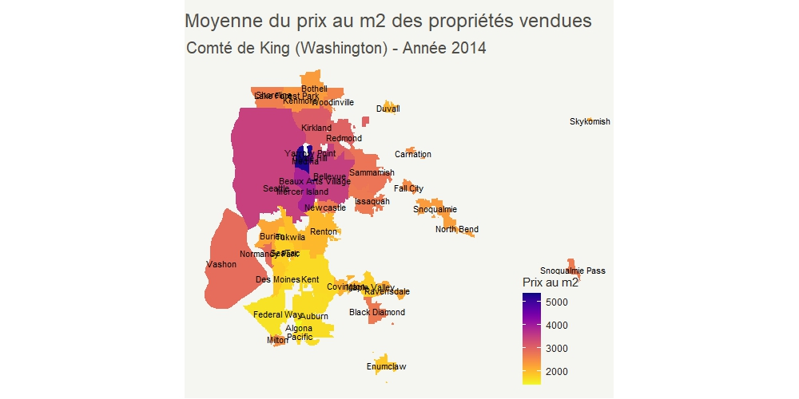

# Analyse & modélisation des prix de propriétés vendues aux Etats-Unis (Comté de King - Etat de Washington)

### Méthodes statistiques utilisées : 
Régressions linéaires simples et multiples, méthode forward stepwise (critères AIC et BIC)

### Objectif du projet : 

Analyse, modélisation et prédiction des prix de propriétés vendues à partir de données issues du dataset :
https://www.kaggle.com/datasets/shree1992/housedata
